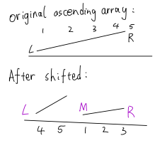

# 23. Shift Position

Given an integer array A, A is sorted in ascending order first then shifted by an arbitrary number of positions, 
For Example, A = {3, 4, 5, 1, 2} (shifted left by 2 positions). 
Find the index of the smallest number.

## Assumptions
There are no duplicate elements in the array

## Examples
+ A = {3, 4, 5, 1, 2}, return 3
+ A = {1, 2, 3, 4, 5}, return 0

## Corner Cases
What if A is null or A is of zero length? We should return -1 in this case.

### 此题最重要的就是联系*shifted ascending array*的性质，用[mid]来确定他与[left]和[right]的大小。然后逐步来缩小范围确定最小值
+ 此方法主要是用Binary Search
+ 如果array[mid] < array[right]，证明从[mid]到[right]是ascending array，那array[mid]就是从[mid]到[right]的最小值，right = mid;
+ 如果array[mid] >= array[right]，证明[mid]的值是从[mid]到[right]的最大值，left = mid + 1（[mid]是大的值所以可以舍弃）;
+ array[left]应该是最小值，因为整个从左到右是



TC: O(logn)

SC：O(1)

```java
public class Solution {
  public int shiftPosition(int[] array) {
    // Write your solution here
    if(array == null || array.length == 0){
      return -1;
    }

    int left = 0;
    int right = array.length - 1;

    while(left < right){
      int mid = left + (right - left) / 2;
      if(array[mid] < array[right]){
        right = mid;
      }else{
        left = mid + 1;
      }
    }
    
    return left;
  }
}
