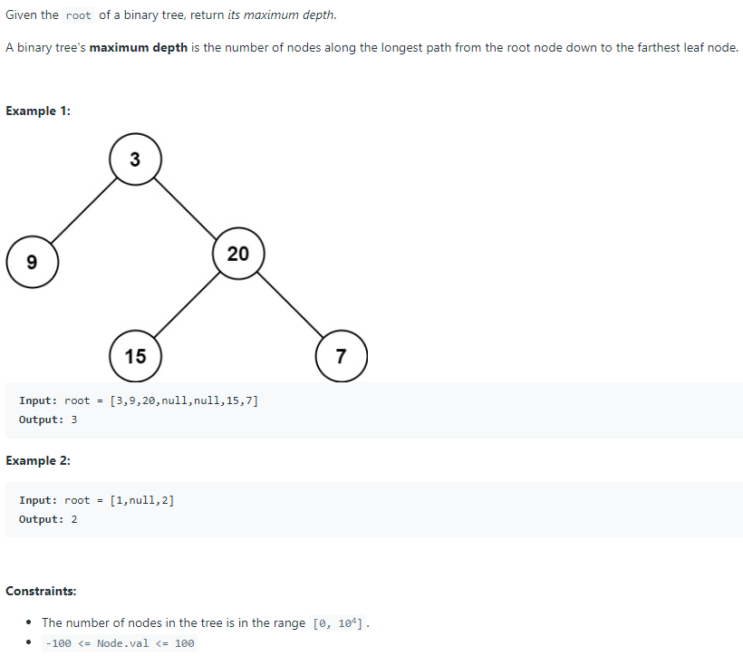

# 104. Maximum Depth of Binary Tree



TC: O(N)

SC: O(logN)

```java
/**
 * Definition for a binary tree node.
 * public class TreeNode {
 *     int val;
 *     TreeNode left;
 *     TreeNode right;
 *     TreeNode() {}
 *     TreeNode(int val) { this.val = val; }
 *     TreeNode(int val, TreeNode left, TreeNode right) {
 *         this.val = val;
 *         this.left = left;
 *         this.right = right;
 *     }
 * }
 */
class Solution {
    public int maxDepth(TreeNode root) {
        
        int result = findMax(root);
        return result;
    }
    
    private int findMax(TreeNode cur){
        if(cur == null){
            return 0;
        }
        
        int left = findMax(cur.left);
        int right = findMax(cur.right);
        
        return Math.max(left, right) + 1;
    }
}
```
