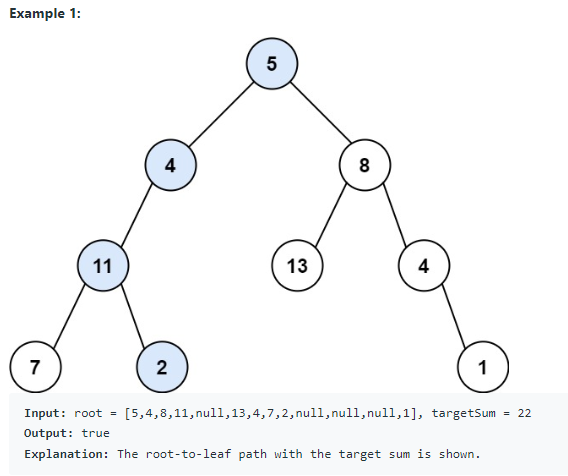
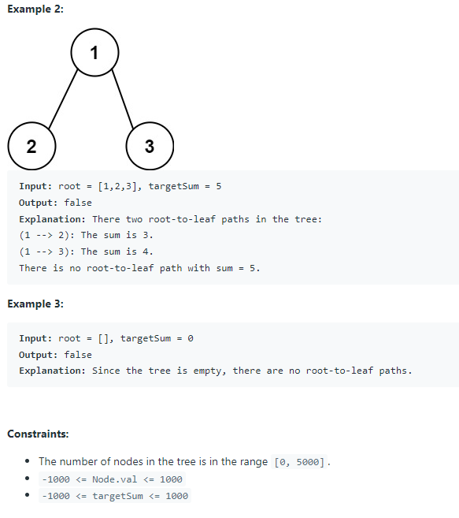

# 112. Path Sum

Given the root of a binary tree and an integer targetSum, return true if the tree has a root-to-leaf path such that adding up all the values along the path equals targetSum.

A leaf is a node with no children.




TC: O(N)

SC: O(logN)

```java
/**
 * Definition for a binary tree node.
 * public class TreeNode {
 *     int val;
 *     TreeNode left;
 *     TreeNode right;
 *     TreeNode() {}
 *     TreeNode(int val) { this.val = val; }
 *     TreeNode(int val, TreeNode left, TreeNode right) {
 *         this.val = val;
 *         this.left = left;
 *         this.right = right;
 *     }
 * }
 */
class Solution {
    public boolean hasPathSum(TreeNode root, int targetSum) {
        //corner case
        if(root == null){
            return false;
        }
        
        targetSum = targetSum - root.val;
        
        //如果到达leaf了，就开始判断
        if(root.left == null && root.right == null){
            return (targetSum == 0);
        }
        
        boolean left = hasPathSum(root.left, targetSum);
        boolean right = hasPathSum(root.right, targetSum);
        
        //判断左右枝干是否能得到正确结果
        return left || right;
    }
}
```
