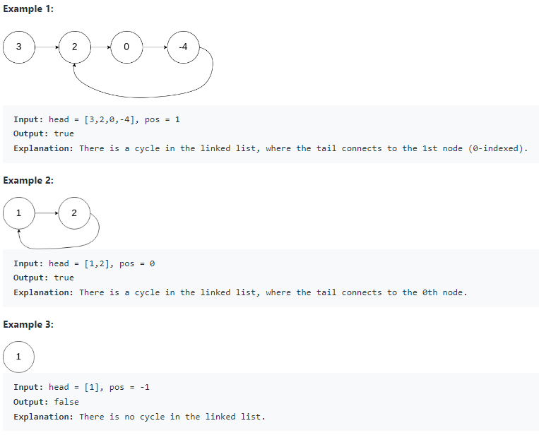

# 141. Linked List Cycle

Given head, the head of a linked list, determine if the linked list has a cycle in it.

There is a cycle in a linked list if there is some node in the list that can be reached again by continuously following the next pointer. Internally, pos is used to denote the index of the node that tail's next pointer is connected to. Note that pos is not passed as a parameter.

Return true if there is a cycle in the linked list. Otherwise, return false.

## Constraints:
+ The number of the nodes in the list is in the range [0, 10^4].
+ -10^5 <= Node.val <= 10^5
+ pos is -1 or a valid index in the linked-list.
 
 
 
 TC: O(n)
 
 SC: O(1)
 
 ```java
 /**
 * Definition for singly-linked list.
 * class ListNode {
 *     int val;
 *     ListNode next;
 *     ListNode(int x) {
 *         val = x;
 *         next = null;
 *     }
 * }
 */
public class Solution {
    public boolean hasCycle(ListNode head) {
        if(head == null || head.next == null){
            return false;
        }
        ListNode slow = head;
        ListNode fast = head;
        
        while(fast != null && fast.next != null){ //为了防止Corner case : [1, 2]
                                                   //必须得有fast.next, 
                                                //因为如果fast.next = null, fast.next.next在运行就会报错，所以不能掉
            slow = slow.next;  //写在前面是为了aviod start
            fast = fast.next.next;
            
            if(slow == fast){
                return true;
            }
        }
        
        return false;
    }
}
 ```
