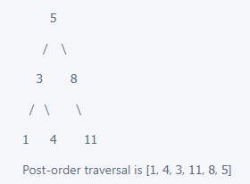

# 145. Binary Tree Postorder Traversal

Given the root of a binary tree, return the postorder traversal of its nodes' values.

## Example:
Example 1:



Post-order traversal is [1, 4, 3, 11, 8, 5]
 
Input: root = [1,null,2,3]
Output: [3,2,1]
Example 2:

Input: root = []
Output: []
Example 3:

Input: root = [1]
Output: [1]

## Constraints:
+ The number of the nodes in the tree is in the range [0, 100].
+ -100 <= Node.val <= 100

## Method 1. Recursion
TC: O(n)

SC: O(n)

```java
/**
 * Definition for a binary tree node.
 * public class TreeNode {
 *     int val;
 *     TreeNode left;
 *     TreeNode right;
 *     TreeNode() {}
 *     TreeNode(int val) { this.val = val; }
 *     TreeNode(int val, TreeNode left, TreeNode right) {
 *         this.val = val;
 *         this.left = left;
 *         this.right = right;
 *     }
 * }
 */
class Solution {
    public List<Integer> postorderTraversal(TreeNode root) {
        List<Integer> result = new ArrayList<>();
        
        helper(root, result);
        return result;
    }
    
    private void helper(TreeNode cur, List<Integer> result){
        if(cur == null){
            return;
        }
        
        helper(cur.left, result);
        helper(cur.right, result);
        result.add(cur.val);
    }
}
```
## Method 1. Iteration
TC: O(n)

SC: O(n)

```java
class Solution {
    public List<Integer> postorderTraversal(TreeNode root) {
        List<Integer> result = new ArrayList<>();
        if(root == null){
            return result;
        }
        
        Deque<TreeNode> stack = new LinkedList<>();
        
        //left   cur
        //right  left
        //cur    right
        stack.offerFirst(root);
        while(!stack.isEmpty()){
            TreeNode cur = stack.pollFirst();
            
            if(cur.left != null){
                stack.offerFirst(cur.left);
            }
            
             if(cur.right != null){
                stack.offerFirst(cur.right);
            }
            
            result.add(cur.val);
        }
        
        Collections.reverse(result);
        return result;
    }
}
```
