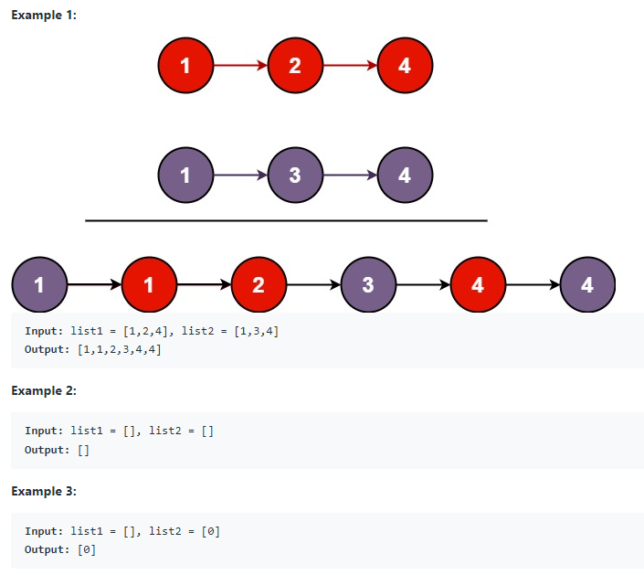

# 21. Merge Two Sorted Lists

You are given the heads of two sorted linked lists list1 and list2.

Merge the two lists in a one sorted list. The list should be made by splicing together the nodes of the first two lists.

Return the head of the merged linked list.



## Constraints:
+ The number of nodes in both lists is in the range [0, 50].
+ -100 <= Node.val <= 100
+ Both list1 and list2 are sorted in non-decreasing order.

## Method 1 -- Iteration
TC: O(n + m)

SC: O(1)

```java
/**
 * Definition for singly-linked list.
 * public class ListNode {
 *     int val;
 *     ListNode next;
 *     ListNode() {}
 *     ListNode(int val) { this.val = val; }
 *     ListNode(int val, ListNode next) { this.val = val; this.next = next; }
 * }
 */
class Solution {
    public ListNode mergeTwoLists(ListNode list1, ListNode list2) {
        ListNode dummy = new ListNode(0);
        ListNode cur = dummy;
        
        while(list1 != null && list2 != null){
            if(list1.val < list2.val){
                cur.next = list1;
                list1 = list1.next;
            }else{
                cur.next = list2;
                list2 = list2.next;
            }
            
            cur = cur.next;
        }
        
        
        if(list1 != null){
            cur.next = list1;
        }
        
        if(list2 != null){
            cur.next = list2;
        }
        
        return dummy.next;
    }
}
```

## Method 2 -- Recursion

TC: O(n + m)

SC: O(n + m)
```java
class Solution {
    public ListNode mergeTwoLists(ListNode list1, ListNode list2) {
    
        
        if(list1 == null){
            return list2;
        }
        
        if(list2 == null){
            return list1;
        }
        
        if(list1.val < list2.val){
            list1.next = mergeTwoLists(list1.next, list2);
                return list1;
        }else{
            list2.next = mergeTwoLists(list1, list2.next);
                return list2;
        }
        
    }
}
```
