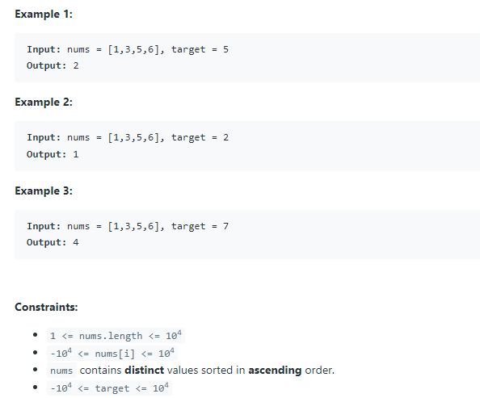

# 35. Search Insert Position

Given a sorted array of distinct integers and a target value, return the index if the target is found. If not, return the index where it would be if it were inserted in order.
You must write an algorithm with O(log n) runtime complexity.



TC: O(logn)

SC: O(1)

```java
class Solution {
    public int searchInsert(int[] nums, int target) {
        int left = 0;
        int right = nums.length - 1;
        
        while(left <= right){ //left < right - 1不行，会导致结果出错往前进了一位
            int mid = left + (right - left) / 2;
            if(target == nums[mid]){
                return mid;
            }else if(target < nums[mid]){
                right = mid - 1;
            }else{
                left = mid + 1;
            }
            
            //left = mid, right = mid不行，会导致陷入死循环
        }
        
        return left;
        
    }
}
```
