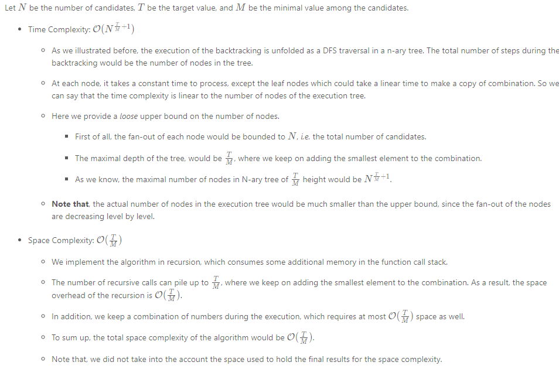

39. Combination Sum
LeetCode-39-Combination-Sum.md


Given an array of distinct integers candidates and a target integer target, return a list of all unique combinations of candidates where the chosen numbers sum to target. You may return the combinations in any order.

The same number may be chosen from candidates an unlimited number of times. Two combinations are unique if the frequency of at least one of the chosen numbers is different.

It is guaranteed that the number of unique combinations that sum up to target is less than 150 combinations for the given input.

 
## Example:
+ Example 1:
Input: candidates = [2,3,6,7], target = 7
Output: [[2,2,3],[7]]
Explanation:
2 and 3 are candidates, and 2 + 2 + 3 = 7. Note that 2 can be used multiple times.
7 is a candidate, and 7 = 7.
These are the only two combinations.

+ Example 2:
Input: candidates = [2,3,5], target = 8
Output: [[2,2,2,2],[2,3,3],[3,5]]

+ Example 3:
Input: candidates = [2], target = 1
Output: []
 

## Constraints:
+ 1 <= candidates.length <= 30
+ 1 <= candidates[i] <= 200
+ All elements of candidates are distinct.
+ 1 <= target <= 500

## TC and SC:



```java
class Solution {
    public List<List<Integer>> combinationSum(int[] candidates, int target) {
        List<List<Integer>> result = new ArrayList<>();
        List<Integer> cur = new ArrayList<>();
        
        helper(result, cur, candidates, target, 0);
        return result;
    }
    
    private void helper(List<List<Integer>> result, List<Integer> cur, int[] candidates, int remain, int index){
        if(remain == 0){
            result.add(new ArrayList<>(cur));
            return;
        }else if(remain < 0){
            return;
        }
        
       // int i = index是为了剪枝
        for(int i = index; i < candidates.length; i++){
            cur.add(candidates[i]);
            helper(result, cur, candidates, remain - candidates[i], i);//Index = i. 为了剪枝
            cur.remove(cur.size() - 1);
        }
    }
}
```
