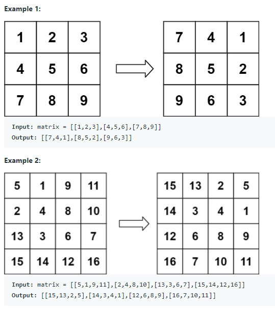

# 48. Rotate Image

You are given an n x n 2D matrix representing an image, rotate the image by 90 degrees (clockwise).

You have to rotate the image in-place, which means you have to modify the input 2D matrix directly. DO NOT allocate another 2D matrix and do the rotation.

 
## Example:


## Constraints:
+ n == matrix.length == matrix[i].length
+ 1 <= n <= 20
+ -1000 <= matrix[i][j] <= 1000

TC: O(M). 

We perform two steps; transposing the matrix, and then reversing each row. Transposing the matrix has a cost of O(M) because we're moving the value of each cell once. Reversing each row also has a cost of O(M), because again we're moving the value of each cell once.

SC: O(1)

```java

class Solution {
    public void rotate(int[][] matrix) {
        int n = matrix.length;
        transpose(matrix, n);  //tanspose, 翻转
        reflectInY(matrix, n); //沿着Y轴再次翻转
        
    }
    
    private void transpose(int[][] matrix, int n){
       // int n = matrix.length;
        //For transpose of the matrix, based on the x = y
        for(int i = 0; i < n; i++){
            for(int j = i + 1; j < n; j++){
                swap(matrix, i, j, j, i);
            }
        }
    }
    
    private void reflectInY(int[][] matrix, int n){
      //  int n = matrix.length;
        for(int i = 0; i < n; i++){
            for(int j = 0; j < n/2; j++){
                swap(matrix, i, j, i, n - j - 1); 
                //这里必须是n - j - 1, 因为最高位是arrary[i][array.length - 1]
            }
        }
    }
    
    private void swap(int[][] matrix, int ax, int ay, int bx, int by){
        int temp = matrix[ax][ay];
        matrix[ax][ay] = matrix[bx][by];
        matrix[bx][by] = temp;
    }
}

```
