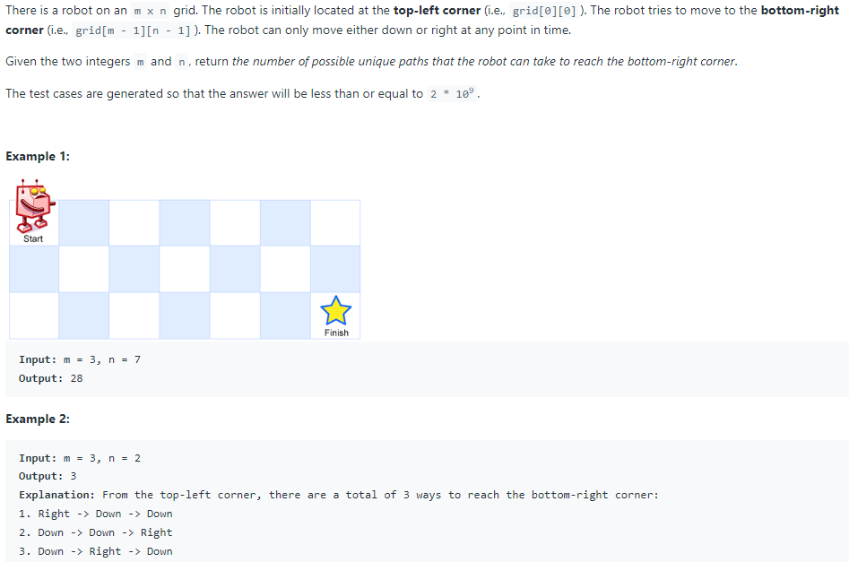

# 62. Unique Paths



## Constraints:
+ 1 <= m, n <= 100

TC: O(N x M)

SC: O(N X M)

```java
class Solution {
    public int uniquePaths(int m, int n) {
        int[][] dp = new int[m][n];
        
        for(int[] arr : dp){
            Arrays.fill(arr, 1); //fill 1 in each row
        }
        
        for(int col = 1; col < m; col++){
            for(int row = 1; row < n; row++){
                dp[col][row] = dp[col - 1][row] + dp[col][row - 1];
            }
        }
        
        return dp[m - 1][n - 1];
    }
}
```
