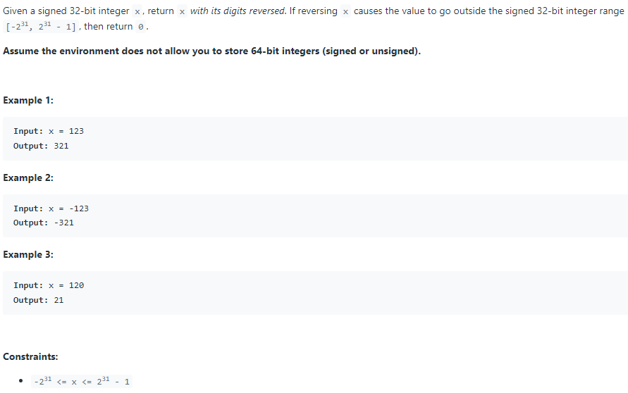

# 7. Reverse Integer
LeetCode-7-Reverse-Integer.md



## Part condsideration:


TC: O(log(x)). 数字是二进制的， There are roughly log_{10}_(x) digits in x.

SC: O(1)

``java
class Solution {
    public int reverse(int x) {
       int pop = 0;
       int rev = 0;
      
        while(x != 0){
            pop = x % 10;
            x = x / 10;
            
            //overflow situation.
            //int的范围是[-2147483648, 2147483647]，所以rev = 2147483640 + 7 == Int_max 
            if(rev > Integer.MAX_VALUE/10 || (rev == Integer.MAX_VALUE && pop > 7)){
                return 0;
            }
            
            if(rev < Integer.MIN_VALUE/10 || (rev == Integer.MIN_VALUE && pop < -8)){
                return 0;
            }
            
            rev = rev * 10 + pop;
        }
        
        return rev;
    }
}
```
