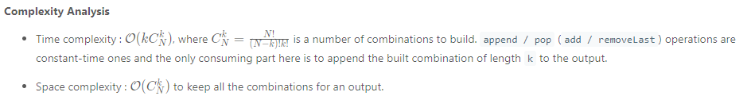

# 77. Combinations

Given two integers n and k, return all possible combinations of k numbers out of the range [1, n].

You may return the answer in any order.

 
## Example:
+ Example 1:

Input: n = 4, k = 2
Output:
[
  [2,4],
  [3,4],
  [2,3],
  [1,2],
  [1,3],
  [1,4],
]

+ Example 2:

Input: n = 1, k = 1
Output: [[1]]
 

## Constraints:
+ 1 <= n <= 20
+ 1 <= k <= n


TC: O(n^2)

SC: O(n^2)

```java
class Solution {
    public List<List<Integer>> combine(int n, int k) {
        List<List<Integer>> result = new ArrayList<>();
        List<Integer> cur = new ArrayList<>();
        combine(result, cur, k, n, 1);
        return result;
    }
    
    private void combine(List<List<Integer>> result, List<Integer> cur, int size, int n, int start){
        if(cur.size() == size){
            result.add(new ArrayList<>(cur));
            return;
        }
        
        for(int i = start; i <= n; i++){
            cur.add(i);
            combine(result, cur, size, n, i + 1);
            cur.remove(cur.size() - 1);
        }
    }
}
```
