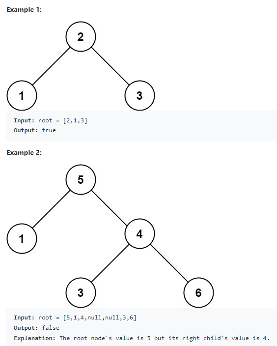

# 98. Validate Binary Search Tree

Given the root of a binary tree, determine if it is a valid binary search tree (BST).

## A valid BST is defined as follows:
+ The left subtree of a node contains only nodes with keys less than the node's key.
+ The right subtree of a node contains only nodes with keys greater than the node's key.
+ Both the left and right subtrees must also be binary search trees.



## Constraints:
+ The number of nodes in the tree is in the range [1, 10^4].
+ -2^(31) <= Node.val <= 2^(31) - 1

TC: O(n)

SC: O(n)

```java
/**
 * Definition for a binary tree node.
 * public class TreeNode {
 *     int val;
 *     TreeNode left;
 *     TreeNode right;
 *     TreeNode() {}
 *     TreeNode(int val) { this.val = val; }
 *     TreeNode(int val, TreeNode left, TreeNode right) {
 *         this.val = val;
 *         this.left = left;
 *         this.right = right;
 *     }
 * }
 */
class Solution {
    public boolean isValidBST(TreeNode root) {
        
        return validate(root, Long.MIN_VALUE, Long.MAX_VALUE);
                                        
    }
    
    private boolean validate(TreeNode cur, long min, long max){
        if(cur == null){
            return true;
        }
        
        if(cur.val <= min || cur.val >= max){
            return false;
        }
        
        return validate(cur.right, cur.val, max) && validate(cur.left, min, cur.val);
    }
}
```
